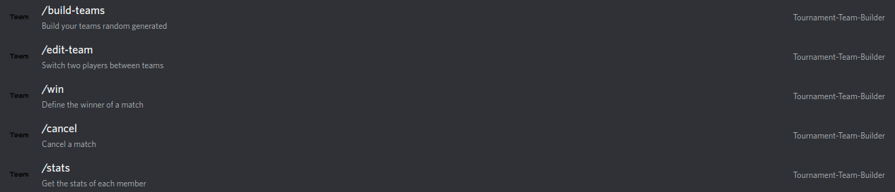
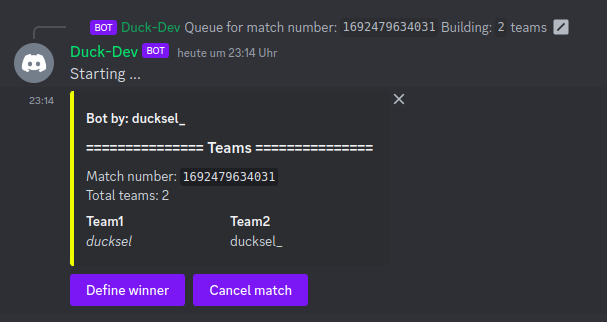
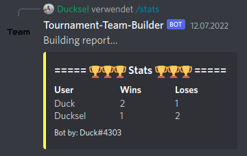

# Discord Random Team Generating Bot

- [What is this repo for](#what-is-this-repo-for)
- [Bot Slash-Commands](#bot-slash-commands)
- [Getting started](#getting-started)
- [Minimum permission requirements for the bot](#minimum-permission-requirements-for-the-bot)

---
## [What is this repo for](#what-is-this-repo-for)

The "Discord Random Team Generating Bot" contains source code and a build file to run your own docker image for a quick start. The DiscordTeamBot is a small bot that can be used to create teams inside your Discord server. Every imaginable setup is possible (for example  1v1v1, 2v2, 2v1, 5v5v5, 3v3v2). The bot will always try to randomly generate balanced teams. So if there are 5 players and you want to build 2 teams, the created match is going to be 3v2. It is possible to build hundreds of teams if you are crazy enough. The bot also keeps stats of the players competing against each other. After one team stands out as a winner you can declare the winning team where every team member gets a point for winning (the same goes for the loser team by increasing the loss points).

---
## [Bot Slash-Commands](#bot-slash-commands)
|command|description|
|---|---|
|build-team|Build your teams random generated|
|edit-team|Switch two playes between teams|
|win|Define the winner of a match|
|cancel|Cancel a match|
|stats|Get the stats of each member|

---
## [Getting started](#getting-started)

---
Running in docker:
1. Create you your first bot on [discord-developer-portal](https://discord.com/developers/applications)
2. Set up your bot and save your bot token since you are able to see it only one time at creation. If you haven't done that you can still reset the token and get a new one.
3. Open the `.env` file and add your bot token to the environment-variable 
4. Now you are pretty much done and you can start your application. You can do that by starting the docker container `$ docker-compose up`.

---
Running in code:
1. Create you your first bot on [discord-developer-portal](https://discord.com/developers/applications)
2. Set up your bot and save your bot token since you are able to see it only one time at creation. If you haven't done that you can still reset the token and get a new one.
3. Define a vm-argument for your bot token `-DBotToken=<your-bot-token>`
4. Create a folder named /matches in your root directory (Might need rw permissions). Or create it elsewhere and use the vm-argument Linux: `-DSaveMatchesPath=/path/to/your/matches/` Windows: `-DSaveMatchesPath=c:\\path\\to\\your\\matches\\`
5. Start your code.

---
## [Minimum permission requirements for the bot](#minimum-permission-requirements-for-the-bot)

Permisson integer: `2211703888`

