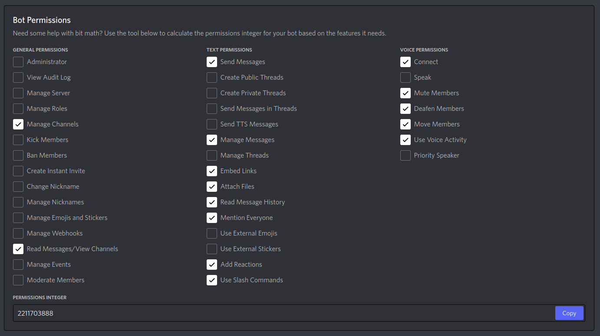

# Discord Random Team Generating Bot

- [What is this repo for](#what-is-this-repo-for)
- [Bot Slash-Commands](#bot-slash-commands)
- [Getting started](#getting-started)
- [Minimum permission requirements for the bot](#minimum-permission-requirements-for-the-bot)
- [Privileged Gateway Intents](#privileged-gateway-intents)

---

## [What is this repo for](#what-is-this-repo-for)

Introducing the "Discord Random Team Generating Bot" – a versatile solution tailored to streamline team creation within your Discord server. This comprehensive package not only includes the essential source code but also equips you with a preconfigured build file, facilitating the rapid deployment of your personalized Docker image.

The DiscordTeamBot stands as a compact yet dynamic bot designed to revolutionize team formation in your community. It boasts a wide array of team configurations. With this bot, the possibilities are boundless. Regardless of your preferred team structure, the bot excels at harnessing the power of randomness to ensure balanced teams for each engagement.

Introducing the New Queue Feature:

Building upon its robust foundation, the DiscordTeamBot now introduces an innovative queue feature that promises to enhance the user experience. With the queue feature, players can express their interest in participating, marking their presence for upcoming matches.

---

## [Bot Slash-Commands](#bot-slash-commands)

|command|description|
|---|---|
|start-queue|Start a queue|
|build-team|Build your teams random generated|
|edit-team|Switch two playes between teams|
|win|Define the winner of a match|
|cancel|Cancel a match|
|stats|Get the stats of each member|

---

## [Getting started](#getting-started)

---
Running in docker:

1. Create you your first bot on [discord-developer-portal](https://discord.com/developers/applications)
2. Set up your bot and save your bot token since you are able to see it only one time at creation. If you haven't done that you can still reset the token and get a new one.
3. Enable the `SERVER MEMBERS INTENT`  and `MESSAGE CONTENT INTENT` for your bot.
4. Open the `.env` file and add your bot token to the environment-variable.
5. Now you are pretty much done and you can start your application. You can do that by starting the docker container `$ docker-compose up`.

---
Running in code:

1. Create you your first bot on [discord-developer-portal](https://discord.com/developers/applications)
2. Set up your bot and save your bot token since you are able to see it only one time at creation. If you haven't done that you can still reset the token and get a new one.
3. Enable the `SERVER MEMBERS INTENT`  and `MESSAGE CONTENT INTENT` for your bot.
4. Define a vm-argument for your bot token `-DBotToken=<your-bot-token>`.
5. Create a folder named /matches in your root directory (Might need rw permissions). Or create it elsewhere and use the vm-argument Linux: `-DSaveMatchesPath=/path/to/your/matches/` Windows: `-DSaveMatchesPath=c:\\path\\to\\your\\matches\\`.
6. Start your code.

---

## [Privileged Gateway Intents](#privileged-gateway-intents)

## [Minimum permission requirements for the bot](#minimum-permission-requirements-for-the-bot)

Permisson integer: `2211703888`

